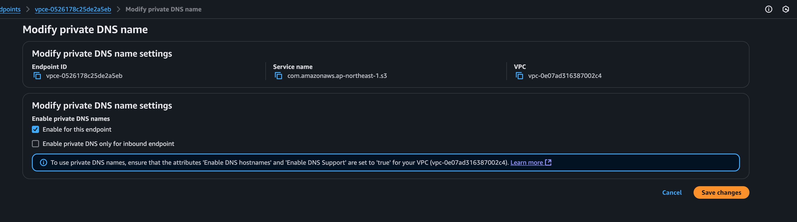

# Solutions of following situation with NACL: 
## 1. Want to access s3 from private EC2 via `S3 Interface endpoint` while NACL is in place.
### Solution:
```
To use `aws s3 ls` from ec2 via interface endpoint, 

*** private DNS name ***
- private_dns_enabled = true
- private_dns_only_inbound_resolver_endpoint = false 
```


## 2. Want to dowload DNF packages without NAT while using NACL
```
To install packages on the private instances, we can use the s3 gateway endpoint, with interface endpoint we cannot do that, because the interface endpoint does not support dual-stack.
```
- DNF automatically resolves to `https://al2023-repos-ap-northeast-1-de612dc2.s3.dualstack.ap-northeast-1.amazonaws.com`

```
>> dnf repolist -v

Loaded plugins: builddep, changelog, config-manager, copr, debug, debuginfo-install, download, generate_completion_cache, groups-manager, needs-restarting, playground, release-notification, repoclosure, repodiff, repograph, repomanage, reposync, supportinfo
DNF version: 4.14.0
cachedir: /var/cache/dnf
Last metadata expiration check: 1:23:33 ago on Sat Jan  4 10:22:43 2025.
Repo-id            : amazonlinux
Repo-name          : Amazon Linux 2023 repository
Repo-revision      : 1733961600
Repo-updated       : Thu Dec 12 00:00:00 2024
Repo-pkgs          : 21723
Repo-available-pkgs: 21723
Repo-size          : 72 G
Repo-mirrors       : https://al2023-repos-ap-northeast-1-de612dc2.s3.dualstack.ap-northeast-1.amazonaws.com/core/mirrors/2023.6.20241212/x86_64/mirror.list
Repo-baseurl       : https://al2023-repos-ap-northeast-1-de612dc2.s3.dualstack.ap-northeast-1.amazonaws.com/core/guids/b690efa7545a71050dcbfc444f88cd84d9cca835298def45abbe81fcc5012a61/x86_64/ (0 more)
Repo-expire        : 172800 second(s) (last: Sat Jan  4 10:22:34 2025)
Repo-filename      : /etc/yum.repos.d/amazonlinux.repo

Repo-id            : kernel-livepatch
Repo-name          : Amazon Linux 2023 Kernel Livepatch repository
Repo-revision      : 1719187200
Repo-updated       : Mon Jun 24 00:00:00 2024
Repo-pkgs          : 28
Repo-available-pkgs: 28
Repo-size          : 658 k
Repo-mirrors       : https://al2023-repos-ap-northeast-1-de612dc2.s3.dualstack.ap-northeast-1.amazonaws.com/kernel-livepatch/mirrors/al2023/x86_64/mirror.list
Repo-baseurl       : https://al2023-repos-ap-northeast-1-de612dc2.s3.dualstack.ap-northeast-1.amazonaws.com/kernel-livepatch/guids/8fba5c982700fd6aef466dcb6d4603ccf71ee96bfcbc11b955bc1898cb93f2c7/x86_64/ (0
                   : more)
Repo-expire        : 172800 second(s) (last: Sat Jan  4 10:22:43 2025)
Repo-filename      : /etc/yum.repos.d/kernel-livepatch.repo
```

### Solution:
```
S3 gateway endpoint + NACL (whitelist s3 prefix list)
```

## 3. Want to download DNF packages with NAT while using NACL
NAT will resolve to s3 prefix list ips, therefore, it will work
### Solution:
```
NAT + NACL ( whitelist s3 prefix list)
```

### 4. Want to pull docker images using NAT while using NACL
### Solution:
```
NAT + NACL (nslookup registry-1.docker.io ) + NACL (cloudflare ips: https://www.cloudflare.com/ips/)
```